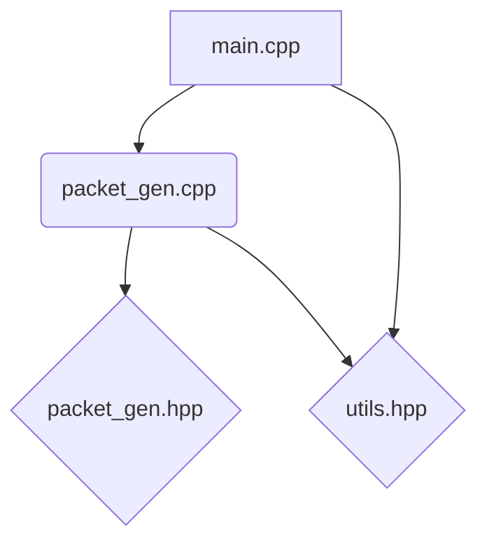

# Software Design Documentation

## Introduction

The `tcp-ip-pkt-gen` project is designed to generate TCP/IP packets for testing and simulation purposes. This document provides a high-level overview of the project's architecture, components, and how to build and run the application.

## High-Level Component Diagram

Here's a high-level overview of the components and their interactions within the `tcp-ip-pkt-gen` project.



### Components

#### Main Application (`main.cpp`)

The `main.cpp` file is the entry point of the application. It initializes the packet generator and handles the command-line arguments.

#### Packet Generator (`packet_gen.cpp` and `packet_gen.hpp`)

The `packet_gen.cpp` and `packet_gen.hpp` files contain the core logic for generating TCP/IP packets. This includes creating packet structures, setting packet headers, and serializing packets to a binary format.

#### Utilities (`utils.hpp`)

The `utils.hpp` file provides utility functions and macros that are used throughout the project. These utilities include logging, error handling, and common data manipulation functions.

### Component Descriptions

* **`main.cpp`**: This is the entry point of the application. It likely initializes the packet generation process and orchestrates the overall flow.
* **`packet_gen.cpp`**: This file contains the implementation of the packet generation logic. It uses the declarations from `packet_gen.hpp`.
* **`packet_gen.hpp`**: This header file declares the interfaces and data structures related to packet generation.
* **`utils.hpp`**: This header file likely contains various utility functions or helper classes used throughout the project, potentially by both `main.cpp` and `packet_gen.cpp`.

### Build and Run

#### Building the Project

To build the project, navigate to the root directory of the repository and run the following commands:

```sh
make
```

This will compile the project and generate the executable in the `bin` directory.

#### Running the Application

To run the application, use the following command:

```sh
./bin/debugBin
```

This will execute the packet generator with default settings. You can also provide command-line arguments to customize the behavior.

### Testing and Validation

#### Unit Tests

The project includes unit tests written using the Google Test framework. To run the unit tests, navigate to the `test` directory and run the following command:

```sh
make test
```

This will compile and run the unit tests, providing detailed output on the test results.

#### Integration Tests

In addition to unit tests, the project includes integration tests to ensure that the packet generator works correctly with the rest of the system. These tests can be run using the same command as the unit tests.

### Future Improvements

* **Enhanced Packet Generation**: Add support for more complex packet structures and protocols.
* **Performance Optimization**: Optimize the packet generation process to handle larger volumes of packets more efficiently.
* **User Interface**: Develop a graphical user interface (GUI) to make the packet generator more user-friendly.
* **Documentation**: Improve the documentation with more detailed examples and tutorials.
